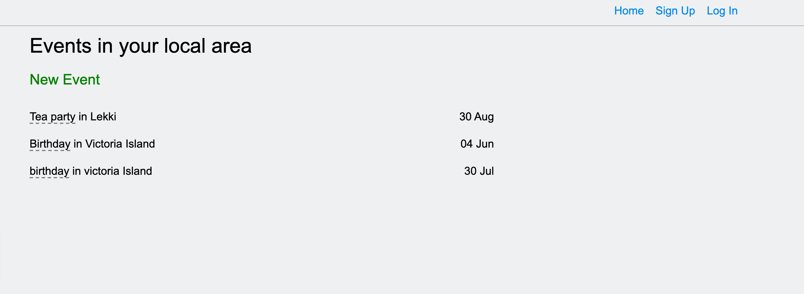

# private-events

Simple rails webapp for organizing events.

> This project was originally proposed by The Odin Project [link](https://www.theodinproject.com/paths/full-stack-ruby-on-rails/courses/ruby-on-rails/lessons/associations).

#### [Live version](https://pacific-hollows-10915.herokuapp.com/)

## Built With

- Ruby 3.0.1
- Rails
- sqlite3

## Getting Started

**To use the code in this project, you'll need to have Ruby, Rails and sqlite3 installed in your computer.**

To get a local copy up and running follow the following simple steps:

On GitHub bash:

  - To clone the project to your computer, run `git clone https://github.com/notlfish/private-events.git`
  - To enter the project folder, run `cd private-events`.
  - To set up the database, run `rails db:migrate`
  - To start the app, run `rails server`
  - Open http://localhost:3000/ in a browser to the home page of the web app.
  - Follow the navigation links to access the app's functionality.

### Prerequisites

Ruby, Rails and sqlite3 must be installed on your computer

### Run tests

- RuboCop is set up to run locally. Just run `rubocop` in the root of the repo.

## Authors

👤 **Ihedoro Fortunatus**

- GitHub: [@fortuneonyeka](https://github.com/fortuneonyeka/)
- Twitter: [@onyekafortune](https://twitter.com/AngelaCunaDev)
- LinkedIn: [@fortunatus-ihedoro](https://www.linkedin.com/in/fortunatus-ihedoro/)

👤 **Lucas Ferrari Soto**

- GitHub: [@notlfish](https://github.com/notlfish)
- Twitter: [@LucasFerrariSo1](https://twitter.com/LucasFerrariSo1)
- LinkedIn: [LinkedIn](https://www.linkedin.com/in/lucas-mauricio-ferrari-soto-472a3515a/)

## 🤝 Contributing

Contributions, issues, and feature requests are welcome!

Feel free to check the [issues page](https://github.com/notlfish/ruby-bubble-sort/issues).

## Show your support

Give a ⭐️ if you like this project!

## Acknowledgments

This code is a project for [Microverse](https://www.microverse.org/), and its specification was taken from [The Odin Project](https://www.theodinproject.com/home)

## 📝 License

This project is [MIT](./LICENSE) licensed.
